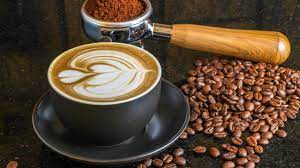
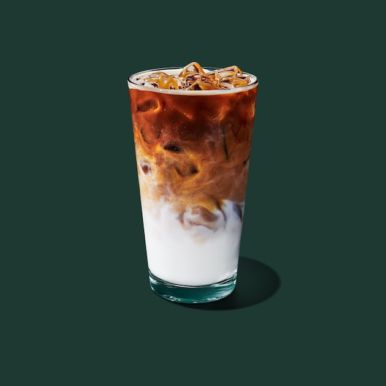

# WEB COFFEE

***Web Coffe using*** HTML, CSS, & Javascript

**Bagian Head**

```head of html
 <head>
    <meta charset="UTF-8" />
    <meta http-equiv="X-UA-Compatible" content="IE=edge" />
    <meta name="viewport" content="width=device-width, initial-scale=1.0" />
    <title>De'Ekpresso Cafe</title>
    <!-- Google Fonts -->
    <link rel="preconnect" href="https://fonts.googleapis.com" />
    <link rel="preconnect" href="https://fonts.gstatic.com" crossorigin />
    <link href="https://fonts.googleapis.com/css2?family=Poppins:ital,wght@0,300;0,400;0,700;1,100;1,700&display=swap" rel="stylesheet" />
    <!-- Feather Icons -->
    <!-- <script src="https://unpkg.com/feather-icons"></script> -->
    <script src="https://cdn.jsdelivr.net/npm/feather-icons/dist/feather.min.js"></script>
    <!-- My Style -->
    <link rel="stylesheet" href="css/style.css" />
    
  </head>

```

**Bagian Navbar**

```navbar in html
 <nav class="navbar">
      <a href="#home" class="navbar-logo">De' Ekpresso <span>Cafe</span></a>
      <div class="navbar-nav">
        <a href="#home">Home</a>
        <a href="#about">About Us</a>
        <a href="#menu">Portofolio</a>
        <a href="#messageus">Message Us</a>
      </div>

    </nav>
    <br/><br/>

```

**Bagian Hero**

```hero section in html

<section class="hero" id="home">
      <main class="content">
        <br/>
        <h1> Hi <span id="name">  </span></h1>
        <p>Selamat Datang di De'Ekpresso Cafe</p>
        <p>Kopi terbaik dengan bergaya america classic</p>

        <div class="w3-content w3-section" style="max-width:6000px; height:auto;">
          
          
          
        </div>
        

      </main>
    </section>

```

**Bagian About**

```about section in html

<section class="about" id="about">
      <h2><span>About</span> Us</h2>
      <div class="row">
        <div class="about-img">
          
        </div>
        <div class="content">
         <h2>Kenapa Milih Kopi kami?</h2>
          <p>De'Ekpresso Cafe ini didesian bergaya America. Hadirnya tempat kuliner ini juga menunjang pariwisat,
             dikonsep hiburan keluarga yang ditampilkan untuk memenuhi kebutuhan hiburan bagi masyarakat. Di sini berbagai macam kopi minuman.</p>

             <section class="vision-mission">
              <!-- Visi -->
              <div class="mision">
            <h2 style="padding-bottom: 10px; font-size: 2em;">Visi Kami</h2>
          <p class="has-text-color has-text-align-center has-foreground-light-color">
            "Menjadikan Cafe kopi  sebagai Tempat dan Rasa untuk dikenang bagi para Pelanggan, 
            dengan memberikan pelayanan yang terbaik, produk yang berkualitas serta tempat dan atmosfir yang nyaman, 
            sehingga menjadikan Restoran sebagai pilihan utama."
          </p>
          </div>
          <div class="mision">
            <h2>Misi Kami</h2>
          <p class="has-text-color has-text-align-center has-foreground-light-color">
            "Menciptakan atmosfer yang natural dan relax dengan fasilitas-fasilitas yang menunjang demi meningkatkan 
            kenyamanan pelangan."</p>
          <p class="has-text-color has-text-align-center has-foreground-light-color">
            "Kami berkomitmen untuk membentuk tim yang solid yang dapat melayani secara professional serta mempunyai  etika bisnis yang baik."</p>
          </div>
        </div>
      </div>
    </section>

```

**Bagian Menu**

```menu section in html

<section class="menu" id="menu">
      <h2><span>Premium</span> Quality</h2>
     
      <div class="row">
        <div class="menu-card">
          
          <h3 class="menu-card-title">- Coffe Latte -</h3>
          <p class="menu-card-price">IDR 10k</p>
        </div>
        <div class="menu-card">
          
          <h3 class="menu-card-title">- Brown Sugar -</h3>
          <p class="menu-card-price">IDR 18k</p>
        </div>
        <div class="menu-card">
          
          <h3 class="menu-card-title">- Matcha -</h3>
          <p class="menu-card-price">IDR 20k</p>
          </div>
          <div class="menu-card">
          
          <h3 class="menu-card-title">- Americano -</h3>
          <p class="menu-card-price">IDR 10k</p> </div>
          <div class="menu-card">
          
          <h3 class="menu-card-title">- Caramel -</h3>
          <p class="menu-card-price">IDR 25k</p></div>
        </div>
      </div>
    </section>

```

**Bagian Menu**

```menu section in html

<section class="menu" id="menu">
      <h2><span>Temukan</span> Kami</h2>
     
      <div class="row">
        <div class="menu-card">
          
          <h3 class="menu-card-title"> Jakarta</h3>
          <div class="overlay"></div>
          
        </div>
        <div class="menu-card">
          
          <h3 class="menu-card-title">Tasikmalaya</h3>
          <div class="overlay"></div>
          
        </div>
        
    </section>

```

**Bagian Contact**

```contact section in html

<section id="messageus" class="messageus">

          <div class="row">
          <form name="message-form" id = "message-form">
            <fieldset>
              <legend>Message Us</legend>
              
              Nama:
              <br/>
              <input placeholder="Nama" type="text" name="full-name" />
              <br /><br />
    
              Tanggal Lahir:
              <br/>
              <input type="date" name="birth-date"  />
              <br /><br />
    
              Jenis Kelamin:
              <br/>
              <input type="radio" id="male" name="gender" value="male" />
              <label for="male">Laki-laki</label>
              <input type="radio" id="female" name="gender" value="female" />
              <label for="female">Perempuan</label>
              <br /><br />
    
              Pesan:
              <br/>
              <textarea placeholder="Pesan" name="messages"></textarea>
              <br /><br />
    
              <button class="submit" onclick="tampilkanPesan()">Klik tombol ini!</button>
            </fieldset>
          
          </form>
          </div>
          <br/> 
          <div id="sender-data">
   </div>
      </div>
    </section>

```

**Bagian Footer**

```footer section in html

<footer>
      <div class="credit">
        <p>Created by <a href="https://github.com/ichsananawin07">Nur Ichsana Nawin Putri</a></p>
      </div>
    </footer>
    <!-- Footer -->
    <!-- Feather Icons -->
    <script>
      feather.replace();
    </script>
    <!-- My Script -->
    <script src="js/script.js"></script>
  </body>
</html>


```

**Tambahkan CSS nya ya :)**

```css

/* Google Fonts */
@import url("https://fonts.googleapis.com/css2?family=Poppins:ital,wght@0,300;0,400;0,700;1,100;1,700&display=swap");

/* Reset */
:root {
  --primary: #b6895b;
  --dark: #010101;
  --white: #fff;
}

* {
  margin: 0;
  padding: 0;
  box-sizing: border-box;
  outline: none;
  border: none;
  text-decoration: none;
}

html {
  scroll-behavior: smooth;
}

body {
  font-family: "Poppins", sans-serif;
  background-color: var(--dark);
  color: var(--white);
  /* min-height: 5000px; */
}
/* Reset */

/* Navbar */
.navbar {
  display: flex;
  justify-content: space-between;
  align-items: center;
  padding: 1.4rem 7%;
  background-color: rgba(1, 1, 1, 0.8);
  border-bottom: 1px solid #513c28;
  position: fixed;
  top: 0;
  left: 0;
  right: 0;
  z-index: 99999999;
}

.navbar .navbar-logo {
  font-size: 2rem;
  font-weight: 700;
  font-style: italic;
  color: var(--white);
}

.navbar .navbar-logo span {
  color: var(--primary);
}

.navbar .navbar-nav a {
  color: var(--white);
  display: inline-block;
  font-size: 1.3rem;
  margin: 0 1rem;
}

.navbar .navbar-nav a:hover {
  color: var(--primary);
}

.navbar .navbar-nav a::after {
  content: "";
  display: block;
  padding-bottom: 0.5rem;
  border-bottom: 0.1rem solid var(--primary);
  transform: scaleX(0);
  transition: 0.2s linear;
}

.navbar .navbar-nav a:hover::after {
  transform: scaleX(0.5);
}

.navbar .navbar-extra a {
  color: var(--white);
  margin: 0 0 0.5rem;
}

.navbar .navbar-extra a:hover {
  color: var(--primary);
}

#hamburger-menu {
  display: none;
}
/* Navbar */

/* Hero */


.hero::after {
  content: "";
  display: block;
  position: absolute;
  width: 100%;
  height: 30%;
  bottom: 0;
  background: linear-gradient(0deg, rgba(1, 1, 3, 1) 8%, rgba(5, 5, 5, 0) 50%);
}

.hero .content {
  padding: 1.4rem 7%;
  max-width: 60rem;
}

.hero .content h1 {
  font-size: 5em;
  color: var(--white);
  text-shadow: 1px 1px 3px rgba(1, 1, 3, 0.5);
  line-height: 1.2;
}

.hero .content h1 span {
  color: var(--primary);
}

.hero .content p {
  font-size: 1.6rem;
  margin-top: 0.5rem;
  line-height: 1.4;
  font-weight: 100;
  text-shadow: 1px 1px 3px rgba(1, 1, 3, 0.5);
  mix-blend-mode: difference;
}

.hero .content .cta {
  margin-top: 1rem;
  display: inline-block;
  padding: 1rem 3rem;
  font-size: 1.4rem;
  color: var(--white);
  background-color: var(--primary);
  border-radius: 0.5rem;
  box-shadow: 1px 1px 3px rgba(1, 1, 3, 0.5);
}
/* Hero */

/* About Us */
.about,
.menu,
.contact {
  padding: 10rem 7% 1.4rem;
}

.about h2,
.menu h2,
.contact h2 {
  text-align: center;
  font-size: 2.6rem;
  margin-bottom: 8rem;
}

.about h2 span,
.menu h2 span,
.contact h2 span {
  color: var(--primary);
}

.about .row {
  display: flex;
}

.about .row .about-img {
  flex: 1 1 45rem;
}

.about .row .about-img img {
  width: 100%;
}

.about .row .content {
  flex: 1 1 35rem;
  padding: 0 1rem;
}

.about .row .content h2 {
  font-size: 1.8rem;
  margin-bottom: 1rem;
}

.about .row .content h2 span {
  color: var(--primary);
}

.about .row .content h3 span {
  color: var(--primary);
}

.about .row .content p {
  font-size: 1.4rem;
  font-weight: 100;
  margin-bottom: 0.8rem;
  line-height: 1.6;
}
/* About Us */

/* Menu */
.menu h2,
.contact h2 {
  margin-bottom: 1rem;
}

.menu p,
.contact p {
  margin: auto;
  text-align: center;
  max-width: 30rem;
  font-weight: 700;
  line-height: 1.6;
}

.menu .row {
  display: flex;
  flex-wrap: wrap;
  margin-top: 5rem;
  justify-content: center;
}

.menu .row .menu-card {
  text-align: center;
  padding-bottom: 4rem;
}

.menu .row .menu-card img {
  border-radius: 50%;
  width: 80%;
}

.menu .row .menu-card .menu-card-title {
  margin: 1rem auto 0.5rem;
}
/* Menu */

/* Contact */


.submit {
  padding: 10px 20px;
  background-color: #FF5722;
  color: white;
  border: none;
  border-radius: 5px;
  cursor: pointer;
}
/* Contact */

/* Footer */
footer {
  background-color: var(--primary);
  text-align: center;
  padding: 1rem 3rem;
  margin-top: 3rem;
}

footer .credit {
  font-size: 0.8rem;
}

footer .credit a {
  color: var(--dark);
  font-weight: 700;
}
/* Footer */

/* Media Query */
/* Laptop */
@media (max-width: 1366px) {
  html {
    font-size: 75%;
  }
}
/* Tablet */
@media (max-width: 768px) {
  html {
    font-size: 62.5%;
  }


/* Mobile */
@media (max-width: 450px) {
  html {
    font-size: 55%;
  }
}
/* Media Query */

```

**Tambahkan sedikit javascript, kalau cuma html sama css aja kurang. Ibarat sayur tanpa garam.**

```javascript

function replaceName(){
let name = prompt("Halo siapakah nama anda?", "");
document.getElementById("name").innerHTML = name;
}
replaceName();

function validateForm() {

    const name = document.forms["message-form"]["full-name"].value;
    const birthDate = document.forms["message-form"]["birth-date"].value;
    const gender = document.forms["message-form"]["gender"].value;
    const message = document.forms["message-form"]["messages"].value;

    if (!name ||  !birthDate || !gender || !message) {
      alert("Semua field harus diisi!");
      return false;
    }

    setSenderUI(name, birthDate, gender, message);
    return true;
  }

  function setSenderUI(name, birthDate, gender, messages) {
    const displayArea = document.getElementById("sender-data");

    displayArea.innerHTML = `
      <h3>Data Pengirim</h3>
      <p><strong>Nama:</strong> ${name}</p>
      <p><strong>Tanggal Lahir:</strong> ${birthDate}</p>
      <p><strong>Jenis Kelamin:</strong> ${gender}</p>
      <p><strong>Pesan:</strong> ${messages}</p>
      `
    ;
  }
  document.getElementById("message-form").addEventListener('submit', (e) => {
    e.preventDefault()
    validateForm()
})

var myIndex = 0;
carousel();

function carousel() {
  var i;
  var x = document.getElementsByClassName("mySlides");
  for (i = 0; i < x.length; i++) {
    x[i].style.display = "none";  
  }
  myIndex++;
  if (myIndex > x.length) {myIndex = 1}    
  x[myIndex-1].style.display = "block";  
  setTimeout(carousel, 2000); // Change image every 2 seconds
}

```

Hasil jadinya
